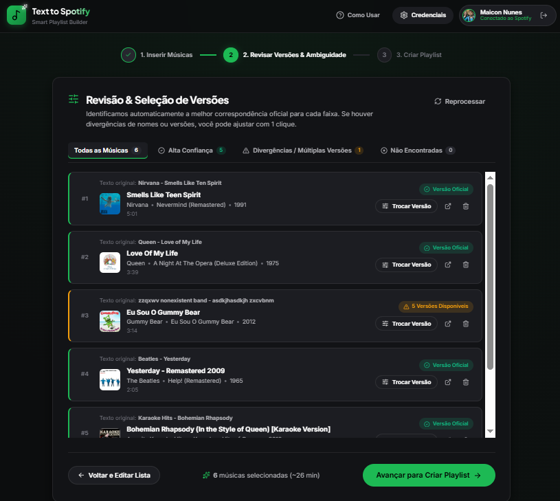
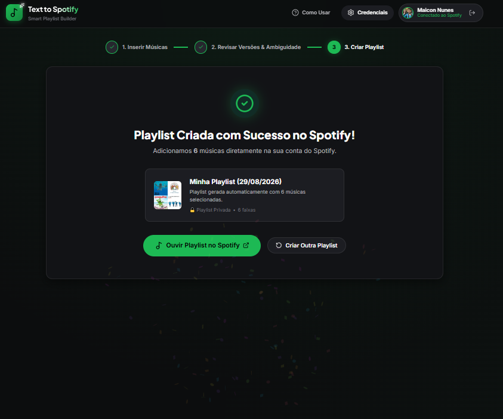

# Text to Spotify Playlist

Aplicação web que transforma listas de músicas e setlists em texto em playlists reais no Spotify, com limpeza automática, detecção de artista, busca inteligente e revisão antes da criação.

<p align="center">
  
  
  
  
  
</p>


## O que resolve

Setlists copiadas do YouTube normalmente chegam com timestamps, cabeçalhos, formatos inconsistentes e nomes incompletos. O aplicativo interpreta esse texto, encontra as faixas no catálogo oficial do Spotify e permite revisar o resultado antes de criar a playlist.

## Principais recursos

- remoção automática de timestamps, numeração e cabeçalhos;
- detecção do artista global de uma setlist;
- suporte a diferentes formatos de `Artista - Música` e `Música - Artista`;
- busca em cascata na Spotify Web API;
- ranking por similaridade normalizada de artista e título;
- penalização de covers, karaokês e versões instrumentais quando não solicitados;
- classificação de resultados por confiança;
- troca manual da gravação antes da criação;
- autenticação OAuth 2.0 com PKCE;
- renovação automática de token e repetição de requisições após `401`.

## Arquitetura

O projeto é 100% client-side. A interface conversa diretamente com os endpoints oficiais do Spotify.

```text
src/
├── services/
│   ├── parser.ts       # interpretação e normalização da entrada
│   ├── spotifyApi.ts   # busca, scoring e criação da playlist
│   └── auth.ts         # OAuth 2.0 PKCE e sessão
├── components/         # interface e fluxo de revisão
├── types/spotify.ts    # contratos TypeScript da API
└── App.tsx             # orquestração da aplicação
```

A regra de negócio fica separada da UI. A busca começa por consultas estruturadas e amplia progressivamente apenas quando necessário.

## Em uso

| Revisão das faixas | Playlist criada |
| --- | --- |
|  |  |

Os testes de uso incluem entradas com erro de digitação, várias gravações possíveis, artista incompleto, entrada inexistente e karaokê solicitado explicitamente.

## Stack

React 19 · TypeScript 6 · Vite 8 · Spotify Web API · OAuth 2.0 PKCE · Oxlint

## Como rodar

Pré-requisitos: Node.js 20+ e uma conta Spotify.

```bash
git clone https://github.com/mikerock12/PlaylistSpotify.git
cd PlaylistSpotify
npm install
npm run dev
```

Crie um aplicativo no Spotify Developer Dashboard, configure `http://127.0.0.1:5173` como Redirect URI e informe o Client ID na própria aplicação.

```bash
npm run dev      # desenvolvimento
npm run build    # type-check + build
npm run preview  # prévia do build
npm run lint     # análise estática
```

## Limitações da API

Apps em Development Mode podem receber respostas reduzidas da Spotify Web API. Campos como `popularity` e `preview_url` são tratados como opcionais; o ranking e a interface se adaptam quando eles não estão disponíveis.

## Segurança

- não existe `client secret` no projeto;
- Client ID e tokens permanecem no navegador;
- `.env` não é versionado;
- autenticação via PKCE.

## Autor

**Maicon Nunes** — [@mikerock12](https://github.com/mikerock12)
