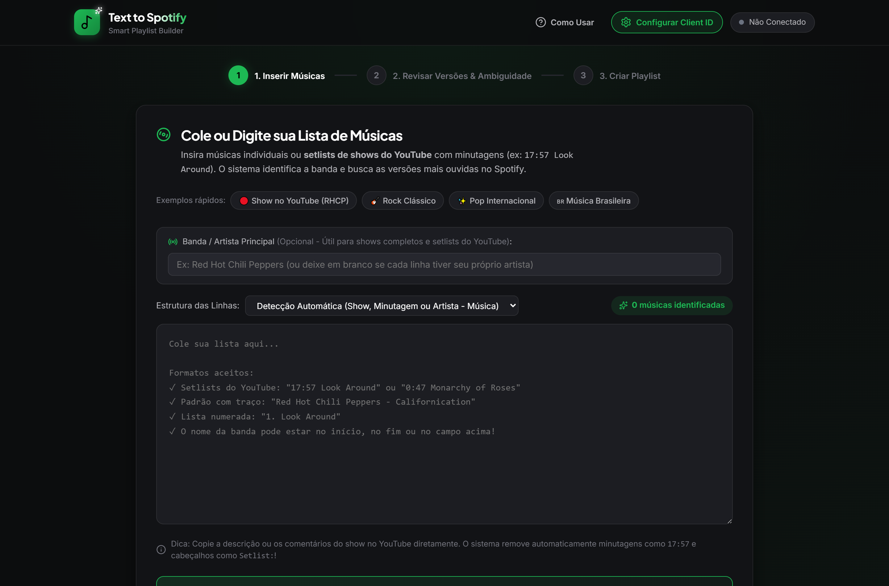
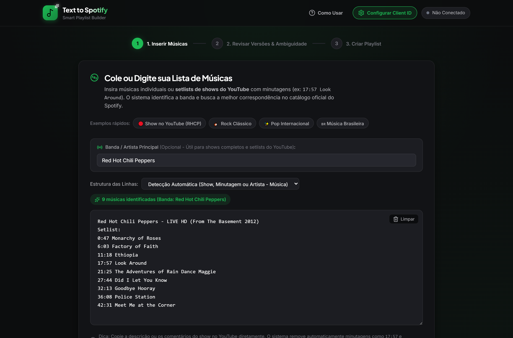
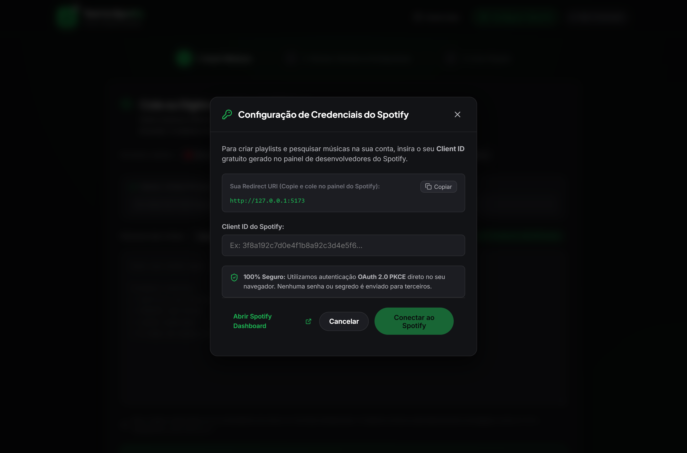
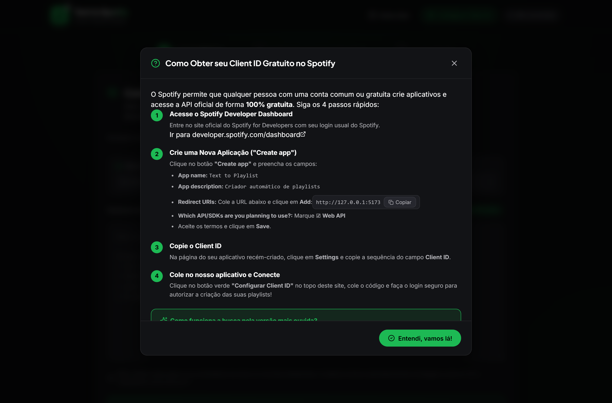

<h1 align="center">🎵 Text to Spotify Playlist</h1>

<p align="center">
  <strong>Cole uma lista de músicas em texto — receba uma playlist oficial no seu Spotify.</strong><br>
  Entende setlists do YouTube com minutagem, detecta a banda sozinho e escolhe a melhor correspondência de cada faixa no catálogo oficial.
</p>

<p align="center">
  
  
  
  
  
</p>

---

## 📖 O que é

Você acha um show completo no YouTube, copia a setlist da descrição — e ela vem assim:

```
Red Hot Chili Peppers - LIVE HD (From The Basement 2012)
Setlist:
0:47 Monarchy of Roses
6:03 Factory of Faith
11:18 Ethiopia
```

Recriar isso na mão no Spotify é tedioso: apagar minutagem, digitar o nome da banda em toda linha, e ainda tomar cuidado para não cair em cover, karaokê ou tributo.

O **Text to Spotify Playlist** faz esse trabalho. Você cola o texto cru, ele limpa, identifica cada faixa no catálogo oficial do Spotify, mostra o que encontrou para você revisar, e cria a playlist na sua conta.

---

## ✨ Funcionalidades

| | |
|---|---|
| 🧹 **Limpeza automática de texto** | Remove minutagens (`0:47`, `17:57`, `1:15:30`, `[17:57]`, `(17:57)`), numeração de faixas (`01.`, `1 -`, `12)`), cabeçalhos (`Setlist:`, `Tracklist`), contagem de visualizações e links. |
| 🎯 **Detecção automática de artista** | Reconhece a banda no título do vídeo (`Red Hot Chili Peppers - LIVE HD (...)`), em prefixos explícitos (`Banda:`, `Artista:`) ou quando o nome aparece isolado na primeira/última linha — e aplica em todas as faixas sem artista. |
| 🔀 **Formatos flexíveis de linha** | Detecção automática, ou forçar `Artista - Música` / `Música - Artista`. Aceita hífen, travessão, dois-pontos, barra, pipe, vírgula e tabulação como separador. |
| 🔥 **Ranqueamento adaptativo** | Combina similaridade de artista e de título e, **quando a API fornece**, a popularidade da faixa. Sem esse dado, o peso é redistribuído e a ordem de relevância do próprio Spotify serve de desempate — veja [Limitações da API](#-limitações-da-api-do-spotify). |
| 🚫 **Filtro anti-cover** | Penaliza resultados marcados como *tribute*, *karaoke*, *cover* e *instrumental version*, evitando as armadilhas clássicas da busca do Spotify. |
| 🚦 **Classificação por confiança** | Cada faixa vira **Alta Confiança**, **Ambígua** ou **Não Encontrada**, com abas para filtrar e resolver só o que precisa de atenção. Erros de digitação são recuperados: `Smells Like Ten Spirit` encontra *Smells Like Teen Spirit*. |
| 🎧 **Troca de versão em um clique** | Abra as 10 melhores alternativas e escolha outra gravação (ao vivo, remaster, single). Se a API devolver `preview_url`, um player de 30s aparece na revisão. |
| 📝 **Playlist sob medida** | Nome, descrição e visibilidade (pública/privada) definidos por você antes de enviar. |
| 🔐 **OAuth 2.0 + PKCE** | Login direto no navegador contra o Spotify. Sem backend, sem *client secret*, sem senha passando por lugar nenhum. |

---

## 🖼️ Como funciona, na prática

### 1. Cole a lista

A tela inicial aceita desde uma lista simples `Artista - Música` até a descrição bruta de um show do YouTube. Há exemplos prontos para testar em um clique.



### 2. O parser resolve o resto

Ao colar uma setlist com minutagem, o app **identifica a banda automaticamente**, remove os timestamps e já mostra quantas faixas foram reconhecidas — tudo antes de qualquer chamada à API.



### 3. Conecte sua conta

A conexão usa apenas o **Client ID** (público) de um app gratuito no painel do Spotify. A Redirect URI é gerada e exibida pronta para copiar.



### 4. Guia embutido

Um passo a passo dentro do próprio app explica como gerar o Client ID em 4 etapas, sem sair da tela.



> As telas **2. Revisar Versões & Ambiguidade** e **3. Criar Playlist** exigem uma sessão autenticada do Spotify e por isso não estão nas capturas acima.

---

## 🧠 Características de desenvolvimento

**Arquitetura 100% client-side.** Não existe servidor próprio: o navegador fala direto com `accounts.spotify.com` e `api.spotify.com`. Isso elimina a superfície de backend e, junto com o PKCE, dispensa qualquer segredo de aplicação.

**Separação em camadas.** A regra de negócio vive fora da UI:

```
src/
├── services/
│   ├── parser.ts       # Análise de texto: timestamps, artista global, separadores
│   ├── spotifyApi.ts   # Busca em cascata, scoring, criação de playlist
│   └── auth.ts         # OAuth 2.0 PKCE, persistência e refresh de token
├── components/         # UI em passos + modais
├── types/spotify.ts    # Contratos de tipo compartilhados
└── App.tsx             # Orquestração de estado e fluxo entre passos
```

**Busca em cascata com fallbacks.** A consulta ao Spotify não é uma tentativa só: começa com a query estruturada (`artist:` + `track:`), degrada para busca livre, depois para o título limpo de sufixos (`(Live)`, `feat. ...`) e, por último, só o título. Cada nível só roda se o anterior não trouxe resultado.

**Scoring determinístico e auditável.** O `totalScore` é uma fórmula explícita sobre similaridade de Jaccard com normalização Unicode (acentos removidos, caixa unificada):

- **Com popularidade:** `artistSim × 0.35 + titleSim × 0.35 + popularidade × 0.30 − penalidades`
- **Sem popularidade:** `artistSim × 0.50 + titleSim × 0.50 − penalidades`

Empates dentro de 0,05 são desempatados pela popularidade quando existe, e pela ordem nativa do Spotify quando não. Um segundo colocado colado no primeiro só marca a faixa como **ambígua** se for outra gravação — a mesma música em outro lançamento (remaster, single, coletânea) não é ambiguidade, e `isSameRecording()` faz essa distinção comparando título sem sufixos e artista.

**Degradação explícita, nunca silenciosa.** Campos que a API pode omitir são tratados como ausentes, não como zero. `popularity` faltando redistribui o peso em vez de zerar o score de todos os candidatos; `preview_url` faltando remove o botão de play em vez de deixar um controle que não toca nada. A interface só afirma o que os dados sustentam.

**Resiliência de sessão.** Token renovado automaticamente via `refresh_token`; um `401` no meio de um lote dispara o refresh e refaz a requisição. A troca do `authorization_code` é protegida contra corrida por uma promise única, evitando o erro de código reutilizado no retorno do OAuth.

**Busca em lote com concorrência limitada.** As faixas são processadas em blocos de 3 requisições paralelas, com barra de progresso — rápido o bastante sem provocar rate limit da API.

**TypeScript estrito.** Todas as respostas da API têm tipo declarado em `types/spotify.ts`. Lint com **Oxlint** (Rust) e build com **Vite 8** + **React 19**.

---

## ⚠️ Limitações da API do Spotify

Apps sem acesso estendido recebem uma resposta reduzida da Web API. Verificado em **29/08/2026** com credenciais em Development Mode:

| Recurso | Situação |
|---|---|
| `popularity` na busca e em `/v1/tracks/{id}` | campo **ausente** |
| `preview_url` (prévia de 30s) | campo **ausente** |
| `GET /v1/tracks?ids=` (lote) | **403 Forbidden** |
| `GET /v1/tracks/{id}`, `/v1/artists/{id}`, `/v1/me`, busca, criação de playlist | **200 OK** |

O app detecta isso em tempo de execução e se adapta: o ranking passa a se apoiar em similaridade mais a ordem de relevância do Spotify, que na prática já aproxima a versão mais ouvida. Os elementos de interface que dependem dos campos ausentes simplesmente não são renderizados.

Se o seu app tiver **acesso estendido** aprovado pelo Spotify, os campos voltam e o ranking por popularidade entra em ação sozinho, sem mudança de código.

---

## 🔒 Segurança

- **Nenhuma credencial no repositório.** Não há *client secret* — o fluxo PKCE não usa um.
- **O Client ID é seu e fica no seu navegador**, em `localStorage`. Nunca é commitado nem enviado a terceiros.
- **Tokens ficam apenas no seu `localStorage`**, e o botão de desconectar os apaga.
- `.env` está no `.gitignore`. A variável opcional `VITE_SPOTIFY_CLIENT_ID` existe só como conveniência local.
- Redirect URI fixada em `127.0.0.1` (exigência atual do Spotify — `localhost` é rejeitado).

---

## 🚀 Como rodar

**Pré-requisitos:** Node.js 20+ e uma conta Spotify (a gratuita serve).

```bash
git clone https://github.com/mikerock12/PlaylistSpotify.git
cd PlaylistSpotify
npm install
npm run dev
```

Acesse **http://127.0.0.1:5173** (no Windows, `iniciar.bat` sobe o servidor e abre o navegador).

### Gerando seu Client ID

1. Acesse o [Spotify Developer Dashboard](https://developer.spotify.com/dashboard) e clique em **Create app**.
2. Preencha nome e descrição livremente.
3. Em **Redirect URIs**, adicione exatamente `http://127.0.0.1:5173`.
4. Em **Which API/SDKs**, marque **Web API**. Aceite os termos e salve.
5. Em **Settings**, copie o **Client ID** e cole no botão **Configurar Client ID** do app.

### Scripts

| Comando | Descrição |
|---|---|
| `npm run dev` | Servidor de desenvolvimento com HMR |
| `npm run build` | Type-check (`tsc -b`) + build de produção |
| `npm run preview` | Serve o build localmente |
| `npm run lint` | Análise estática com Oxlint |

---

## 🛠️ Stack

**React 19** · **TypeScript 6** · **Vite 8** · **Oxlint** · **Spotify Web API** · **lucide-react** · **canvas-confetti**

---

## 👤 Autor

**Maicon Nunes** — [@mikerock12](https://github.com/mikerock12)
